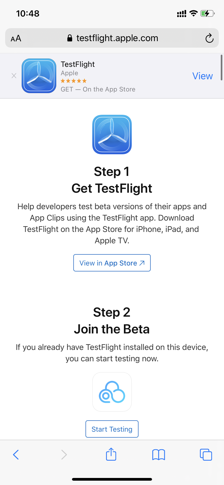
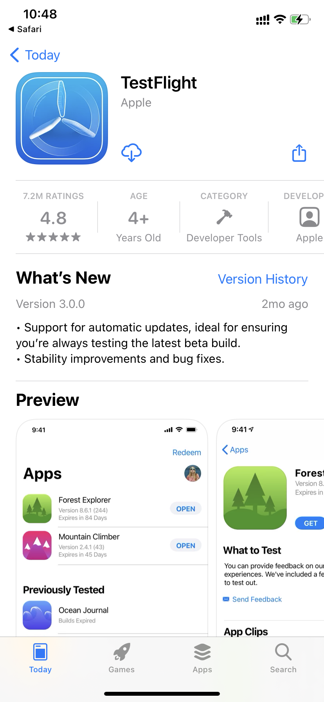
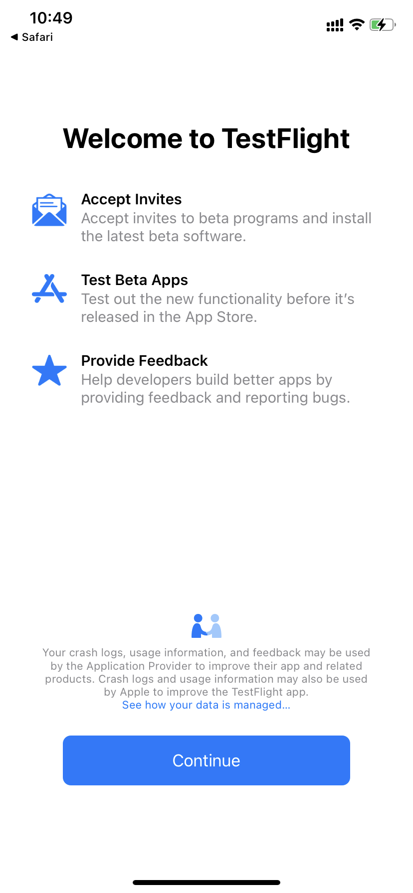
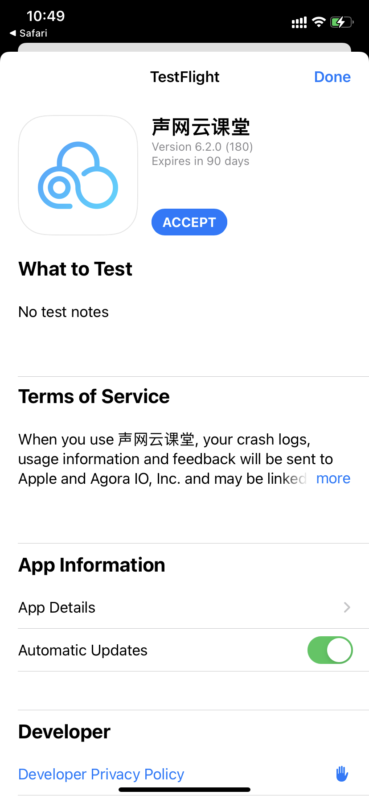
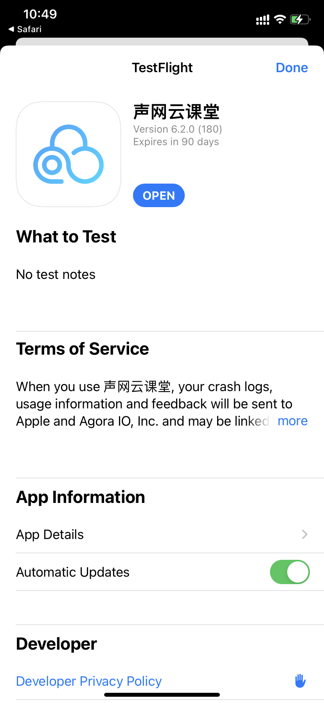

> *其他语言版本：[简体中文](README.zh.md)*

This page introduces how to run the iOS Demo on your iPhone.

1. Open the link in Safari browser: https://testflight.apple.com/join/rSq3pLkr
2. Without you following TestFlight, there will be such a prompt (if it is already installed, go to step 6)

3. Click **View in App Store** to download TestFlight

4. After downloading TestFlight, open TestFlight and click **Continue**

5. Back to step 2, click **Start Test**
6. Click **Accept**, click **Install**

7. Click **Open**
